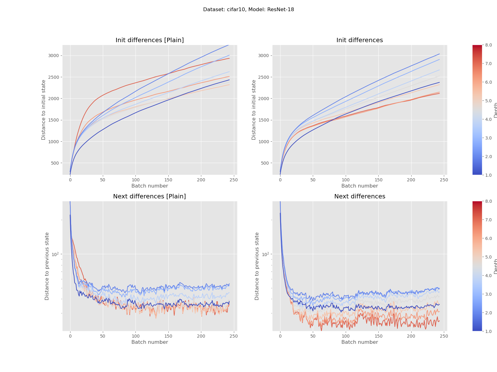
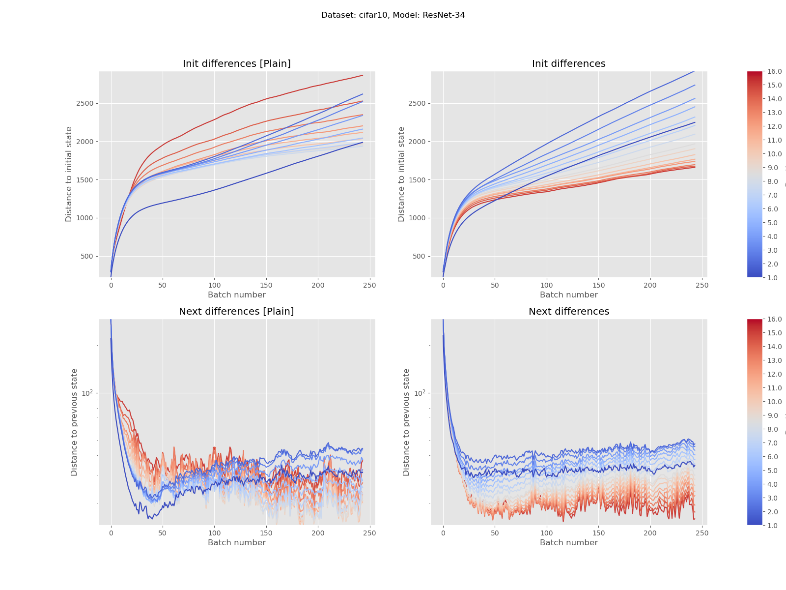
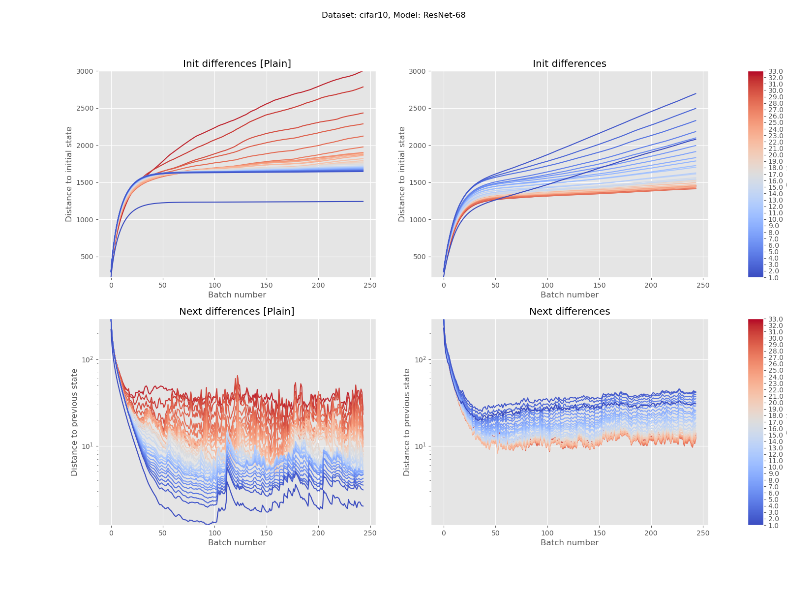
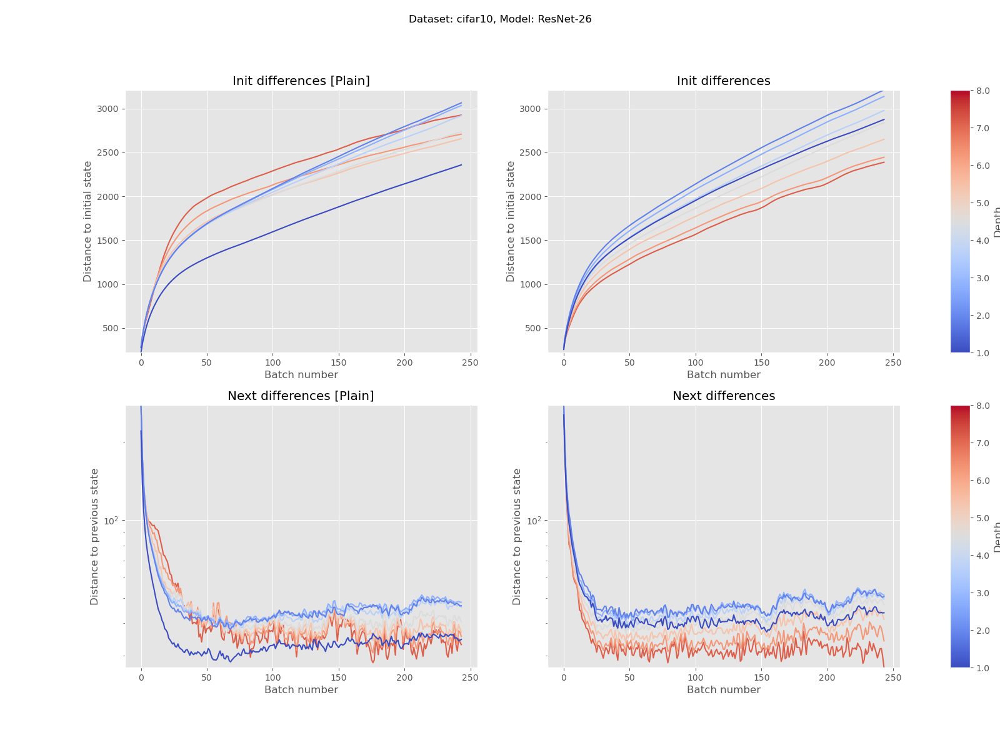
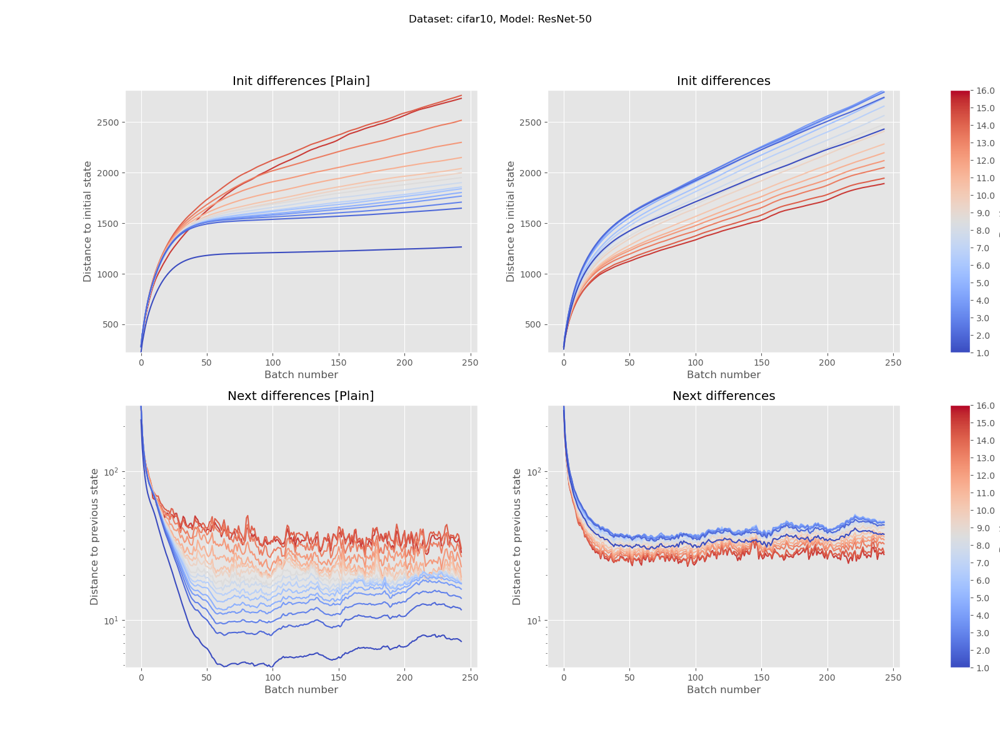
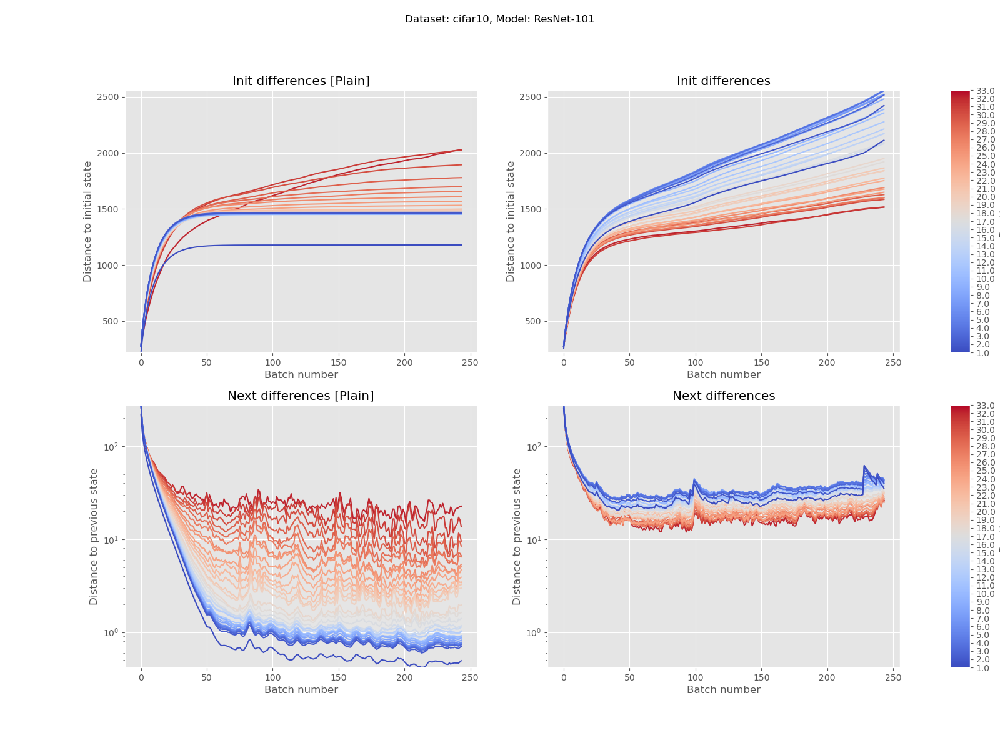

# MLT
Project associated with Machine Learning Theory Course (2024).

## Problem statement

Study of the characteristics of changes in the weights of the neural network depending on layer depth in image recognition.

## Abstract

In the present study, the nature of weight updates in a convolutional neural network was examined with respect to the depth of the layer. Several versions of the ResNet architecture were considered, including basic blocks with and without residual connections. It turns out that the initial intuition that weight updates decrease with distance from the model's output is true only under specific conditions. To observe such behavior, the network must be sufficiently deep and "convolutionally pure" (without additional connections between consecutive layers). The introduction of residual connections leads to the opposite behavior of the optimization algorithm – weights closer to the input of the model undergo larger updates. Additionally, such networks exhibit better learning stability and more uniform error signal propagation across all layers. Furthermore, the validity of utilizing residual connections has been confirmed due to achieving better classification quality during the same learning time, regardless of the total number of layers in the model.

Visit the `main.ipynb` file to reconstruct the experiments.

## Minkowski-Even experiment

### Setting

Twelve different `ResNet` versions has been considered:

1. ResNet-18 with `8` building blocks (*Basic* / *Basic Plain*)
2. ResNet-26 with `8` builiding blocks (*Bottleneck* / *Bottleneck Plain*)
3. ResNet-34 with `16` building blocks (*Basic* / *Basic Plain*)
4. ResNet-50 with `16` builiding blocks (*Bottleneck* / *Bottleneck Plain*)
5. ResNet-68 with `32` building blocks (*Basic* / *Basic Plain*)
6. ResNet-101 with `32` builiding blocks (*Bottleneck* / *Bottleneck Plain*)

Each *convolutional* layer, except the first (inital) and last (classifier) has been set to `128` channels.

The utilised metric to compare distances betwen layers has been Minkowski metric with `p` equal to `1`.

### Detailed results for each model (cifar10)

Vertical axis values are common for plots in the left and right columns. Shallower networks: ResNet18, ResNet26, and ResNet34 generally exhibit the opposite trend than assumed. Both changes relative to the initial state and the previous state are larger for layers with lower depth (closer to the input). For the ResNet-34 version, this opposite trend begins to break down so that for deeper versions without residual connections, it almost achieves complete agreement with the hypothesis (larger updates for deeper layer weights).

Interestingly, for each model from the ResNet+N class, weight updates are greater the closer a layer is to the input, regardless of the total network depth. This may indicate that introducing residual connections significantly facilitates the propagation of feedback signals not only within a building block but in the context of the entire network.

Furthermore, for deeper models (ResNet50, ResNet68, and ResNet101 – Figures 7, 8, and 9), the differences between the largest and smallest updates for consecutive states are significantly greater for networks without residual connections. Models implementing residual connections appear to be more stable during training, dispersing the signal more evenly across all layers.

  

  

    

      
    

    

      
    

    

      
    

  

  

    

      
    

    

      
    

    

      
    

  

### Averaged results

The averaged characteristics of changes relative to previous states for all experiment combinations (all models and all datasets) are presented in the collective Figure 3. Depending on the model class (ResNet-N or ResNet+N), the nature of the changes is drastically different. Weight updates in networks without residual connections increase with depth. Conversely, in networks with residual connections, we observe the opposite trend.

Regarding the average changes relative to the initial state (Figure 10), the observed dependencies are similar in the Appendices section, although some of the trends are more chaotic.

  

  

    

      
    

    

  

    

      
    

  

### Impact on model quality

The validation accuracy plot for all models and datasets is shown in Figure 11 in the Appendices section. Networks with residual connections consistently achieve better results in every case. For very deep architectures, the absence of residual connections can result in no improvement in performance (accuracy at random guessing level). On the other hand, even with residual connections, very deep networks experience a slight decrease in classification accuracy, although this issue seemed significant only for the deepest model, ResNet+101.

    

